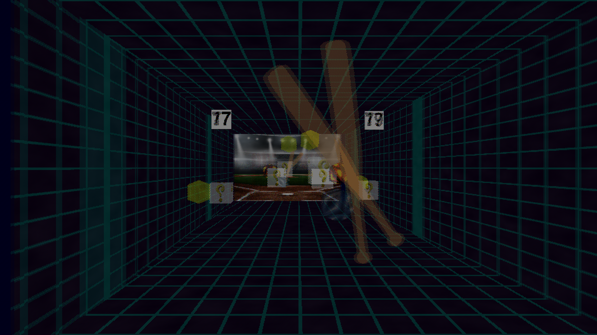

# Stereogame

Projet PAF 2022 - Telecom Paris

This a small project to create a small video game taking advantage of the Alioscopy 3D autostereoscopic screen 1920 * 1080. It was developped in Python using the PyOpenGL library during the PAF course at Telecom Paris for two weeks.

## Installation

First create a virtual environment and activate it:

`python3 -m venv venv`

`source venv/bin/activate`

Then install the dependencies:

`pip install -r requirements.txt`

## Running the demos

To run the demos, you must first activate the virtual environment:

`source venv/bin/activate`

Then you can run the demos:

3D image demo: `python3 demo_planetImage.py`

scene demo: `python3 demo_scene.py`

Stereogame: `python3 stereogame.py`

## Running under Wayland

Stereogame cannot run natively under Wayland and needs to leverage Xwayland. To do that you must add the `PYOPENGL_PLATFORM=x11` prefix to your command. 

For example to run the simple 3D image, run the following:

`PYOPENGL_PLATFORM=x11 python3 demo_planetImage.py`

## Documentation

Informations about the screen can be found [here](https://www.alioscopy.com/en/principles.php)

The documentation of the custom wrapper around PyOpenGL can be found [here](./Feather.md)

## Authors

- Aymane El Firdoussi

- Barthélemy Paléologue

- Kenza Difallah

- Ryan Borhani
